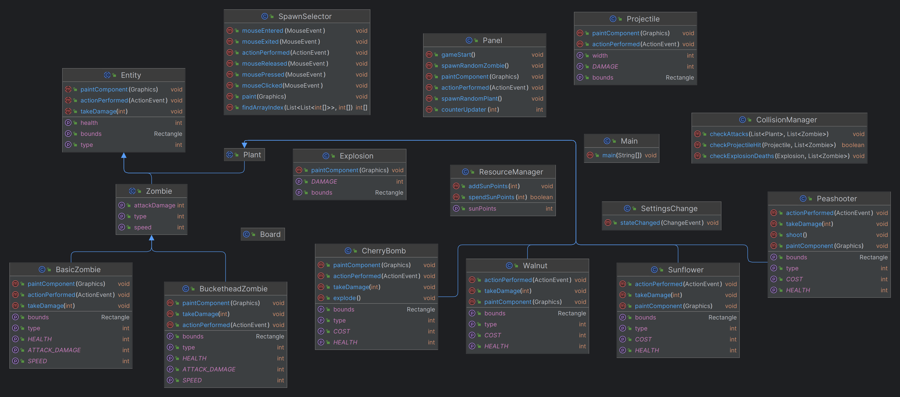

# Plants vs Zombies simulation

A Plants vs Zombies-themed Agent-based model simulation, visualised using Java Swing library.

## Author

- [Antoni Nasternak](https://www.github.com/antkoo)

## Description

In this simulation, plants spawning on the left side of the board need to defend against zombies, coming from the right side of the board. The board is a 5x9 squares, first 5x5 squares are designated for plant spawning and last column is the place of zombies spawning. 
Plants spawn randomly in predetermined spawn squares, that the user needs to specify before the simulation. 
There are different types of plants, that each play a different role in the defense: 
- Sunflowers generate Sun Points, which are needed to create other plants. 
- Peashooters spawn peas (Projectiles), that go towards zombies to deal damage
- Cherry Bombs explode on death or after a certain amount of time, killing all zombies in a 3x3 radius
- Walnuts defend other plants by having a huge amount of health
There are also currently two types of zombies:
- Basic Zombies aren't that strong, but they are fast
- Buckethead Zombies are the opposite, they deal more damage, whilst being slower.
The simulation ends when either all zombies are killed, or one of the zombies reaches the left border of the board.
A user can change different settings, like percentage of certain plants/zombies spawning or the interval between plants/zombies spawning using the GUI based on the Java Swing library.
## Class Diagram

## Documentation

[A javadoc Documentation](Documentation/index.html)

